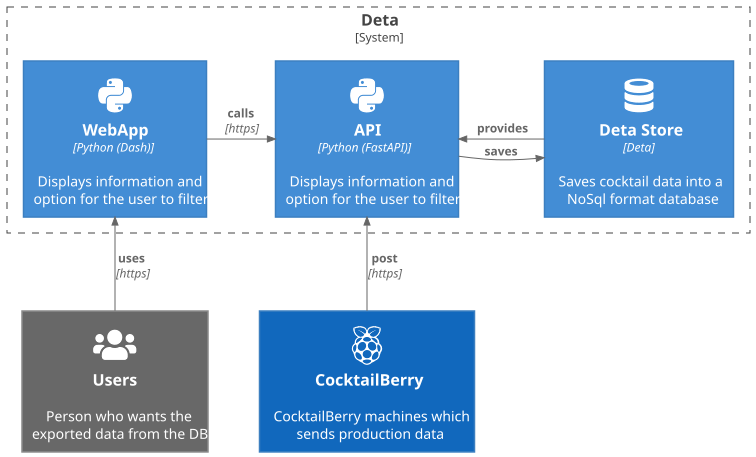

[](https://sonarcloud.io/summary/new_code?id=AndreWohnsland_CocktailBerry-WebApp)


[](https://www.buymeacoffee.com/AndreWohnsland)

WebApp with API and endpoint for [CocktailBerry](https://github.com/AndreWohnsland/CocktailBerry). Have insights into made cocktails.

## Getting Started

### Installing Dependencies

We use [Astral UV](https://docs.astral.sh/uv/) to manage dependencies and run the applications:

```bash
uv sync --all-packages
```

### Running the Application

```bash
# omit uv run if using normal python
uv run uvicorn app:app --reload # backend -> cd backend first
uv run streamlit run streamlit_app.py # frontend, use in main folder
```

The backend needs a mongodb, which can run locally in docker or with a cloud provider.
Copy the `.env.example` in both folders as a `.env` file:

```bash
cp backend/.env.example backend/.env
cp frontend/.env.example frontend/.env
```

The backend example points at the local docker mongodb, replace `ATLAS_URI` with your cloud url if you use one.
Using `DEBUG=1` in the backend env will make the app use a separate `cocktailberry_dev` database, so you can test anything without changing your main one.
The `BACKEND_URL` defaults to the local backend (http://127.0.0.1:8000/api/v1) and must include the `/api/v1` suffix.

### Local Database with Sample Data

Start the mongodb from the compose file and fill it with sample data:

```bash
cd backend
docker compose up -d mongo
uv run python seed_dev.py
```

The seed script uses the same env logic as the app, prints an API key for the protected routes, and skips seeding if data already exists.
To reset the data, remove the container and its volume with `docker compose down -v`.
Alternatively, `docker compose up` starts the whole backend stack (api + db) in docker.
If you deploy backend and frontend on two different places (like streamlit share and a vps), you need to set this variable in the frontend accordingly.
For detailed instruction for deployment, please refer to the according docs of your provider.

## Architecture

In this project, a self hosted web server is used to host the backend.
Currently, streamlit share is used to host the frontend, but it can be easily deployed to any other provider.
The WebApp can be accessed freely over any browser.
The API is protected an can be only accessed with an according API key to prevent unauthorized access.
To get an API key for your [CocktailBerry](https://github.com/AndreWohnsland/CocktailBerry) machine follow the instructions on the website.
Alternatively, you can clone this repo, set up your own dashboard with backend and use the according hook endpoint and header values with the CocktailBerry microservice for your own, private dashboard.



## Access

Simply go to the [site](https://stats-cocktailberry.streamlit.app/) and have nice insight into the data.
If you have build your [CocktailBerry](https://github.com/AndreWohnsland/CocktailBerry) and use the official software, you can get an API key for CocktailBerry to use the provided endpoint to submit your production data. This way, you can actively participate. 🙌

Also, if you directly just want the data for the last 24 hours, for example if you want to give your guest insights in the current developments of the cocktail stats, there is the possibility to add the `?partymode=true` query parameter to the url.
This will cause the "Only Show last 24h Data" checkbox to be checked by default.
