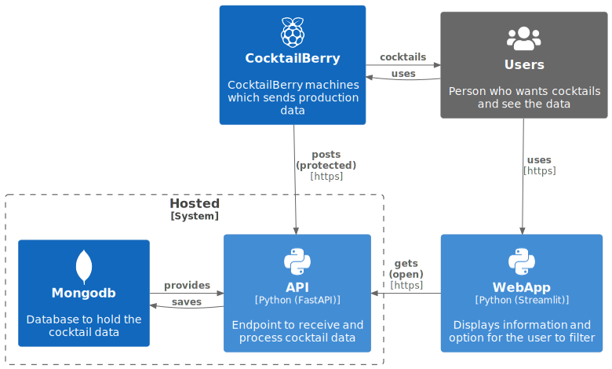

[](https://sonarcloud.io/summary/new_code?id=AndreWohnsland_CocktailBerry-WebApp)


[](https://www.buymeacoffee.com/AndreWohnsland)

WebApp with API and endpoint for [CocktailBerry](https://github.com/AndreWohnsland/CocktailBerry). Have insights into made cocktails.

# Disclaimer

This app is currently still under construction and will get improvements (beta state).

# Getting Started

Either cd into `frontend` or `backend` and run `pip install -r requirements.txt` or use poetry in main folder to install everything for both apps with `poetry install`. Then in the corresponding folder run:

```bash
# omit poetry run if using normal python
poetry run uvicorn main:app --reload # backend
poetry run streamlit run streamlit_app.py # frontend, use in main folder
```

If you want everything to work properly, you need a [deta account](https://web.deta.sh/) and project API key (go to Settings>Create Key). It is used for Deta Base e.g. storing of the data and for the later deployment of the API. Dont' worry it's free (and will always be that way, according to deta). Copy the `.env.example` in both folders as a `.env` file and change the API key dummy to your project API key:

```bash
cp backend/.env.example backend/.env
cp frontend/.env.example frontend/.env
```

Using `DEBUG=1` in the env files will create additional `*_dev` databases to let you test anything without changing your main ones.

# Architecture

In this project, [Deta](https://docs.deta.sh/docs/home/) was used for the hosting. The WebApp can be accessed freely over any browser. The API is protected an can be only accessed with an according API key to prevent unauthorized access. To get an API key for your [CocktailBerry](https://github.com/AndreWohnsland/CocktailBerry) machine follow the instructions on the website. 



# Access

Simply go to the [site](https://stats-cocktailberry.streamlitapp.com/) and have nice insight into the data. If you have build your [CocktailBerry](https://github.com/AndreWohnsland/CocktailBerry) and use the official software, you can get an API key for CocktailBerry to use the prodived endpoint to submit your production data. This way, you can actively participate. 🙌
